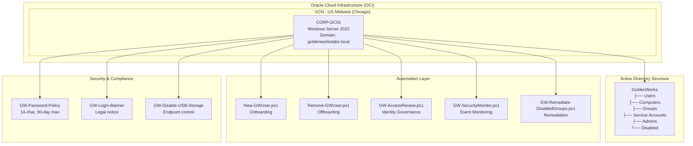

# Hybrid Identity Operations Lab


A simulated enterprise identity and security operations environment built on Oracle Cloud Infrastructure, demonstrating real-world Active Directory administration, identity lifecycle management, GPO governance, PowerShell automation, and security event monitoring.

Built as a portfolio project targeting **Microsoft Security Operations Engineer** and **IAM-focused roles**.

---

## 📋 Table of Contents

- [Overview](#-overview)
- [Architecture](#%EF%B8%8F-architecture)
- [Environment Overview](#environment-overview)
- [Active Directory Structure](#active-directory-structure)
- [Group Policy Objects](#group-policy-objects)
- [Automation Scripts](#automation-scripts)
- [Security Operations Finding](#security-operations-finding)
- [Skills Demonstrated](#skills-demonstrated)
- [Tech Stack](#%EF%B8%8F-tech-stack)
- [Quick Start](#-quick-start)
- [Planned Additions](#planned-additions)
- [Related Projects](#-related-projects)
- [Author](#author)

---

## 📋 Overview

This lab simulates a small-to-medium enterprise identity infrastructure on Oracle Cloud Infrastructure. It includes:

- A fully functional Windows Server 2022 Domain Controller (`goldenworkslabs.local`)
- Populated Active Directory structure with realistic users, groups, and OUs
- Group Policy enforcement for password security, logon banners, and endpoint controls
- PowerShell automation for identity lifecycle (onboarding, offboarding, access reviews)
- Security event log monitoring with real detection examples

---

## 🏗️ Architecture



---

## Environment Overview

| Component | Details |
|---|---|
| Domain Controller | CORP-DC01 — Windows Server 2022 on Oracle Cloud (OCI) |
| Domain | goldenworkslabs.local |
| Domain Mode | Windows Server 2016 |
| FSMO Roles | All held by CORP-DC01 |
| Cloud Platform | Oracle Cloud Infrastructure — US Midwest (Chicago) |

---

## Active Directory Structure

### Organizational Units

```
goldenworkslabs.local
└── GoldenWorks
    ├── Users           # Standard employee accounts
    ├── Computers       # Domain-joined workstations and servers
    ├── Groups          # Security and distribution groups
    ├── Service Accounts # Non-interactive service identities
    ├── Admins          # Privileged admin accounts (separate from user accounts)
    └── Disabled        # Offboarded accounts pending deletion
```

### Users

| Name | Username | Department | Title |
|---|---|---|---|
| John Smith | jsmith | IT | Help Desk Analyst |
| Maria Garcia | mgarcia | Security | Security Analyst |
| James Wilson | jwilson | IT | Systems Administrator |
| Sarah Johnson | sjohnson | HR | HR Manager |
| David Lee | dlee | Finance | Finance Director |
| Admin-JWilson | admin-jwilson | — | Privileged Admin Account |

> Admin accounts are separated from standard user accounts per least-privilege best practices. Privileged users maintain two accounts: one for daily use, one for administrative tasks.

### Security Groups

| Group | Purpose |
|---|---|
| GW-IT-Staff | IT department access entitlements |
| GW-Security-Team | Security operations team access |
| GW-HR-Staff | HR department access entitlements |
| GW-Finance-Staff | Finance department access entitlements |
| GW-Privileged-Admins | Tier 0 administrative accounts |
| GW-VPN-Users | Users permitted remote VPN access |
| GW-AVD-Users | Users permitted Azure Virtual Desktop access |

---

## Group Policy Objects

| GPO | Scope | Purpose |
|---|---|---|
| GW-Password-Policy | Domain | 14-char minimum, 90-day max age, 5-attempt lockout, complexity required |
| GW-Login-Banner | Domain | Legal notice and acceptable use warning on all logons |
| GW-Disable-USB-Storage | Computers OU | Blocks USB mass storage devices on all endpoints |

---

## Automation Scripts

All scripts located at `C:\GoldenWorks\Scripts\` on CORP-DC01.

### New-GWUser.ps1 — Onboarding

Provisions a new user account with correct OU placement, group assignments, and forced password reset at first logon.

```powershell
.\New-GWUser.ps1 -FirstName "Jane" -LastName "Doe" -Department "Security" -Title "SOC Analyst" -Team "Security"
```

### Remove-GWUser.ps1 — Offboarding

Disables account, removes all group memberships, moves to Disabled OU, and renames with ticket reference for audit trail.

```powershell
.\Remove-GWUser.ps1 -SamAccountName "jdoe" -TicketNumber "INC-00421"
```

### GW-AccessReview.ps1 — Identity Governance

Detects stale accounts (90+ day no logon), accounts that have never logged in, and disabled accounts still holding group memberships. Exports CSV report.

```powershell
.\GW-AccessReview.ps1
# Output: C:\GoldenWorks\Reports\AccessReview-YYYY-MM-DD.csv
```

### GW-Remediate-DisabledGroups.ps1 — Automated Remediation

Removes group memberships from disabled accounts with safety exclusions for sensitive built-in accounts (krbtgt, Guest, Administrator).

```powershell
.\GW-Remediate-DisabledGroups.ps1
```

### GW-SecurityMonitor.ps1 — Event Log Monitoring

Queries the Security event log for the last 24 hours and surfaces high-priority identity events. Exports CSV report.

| Event ID | Description |
|---|---|
| 4625 | Failed logon attempt |
| 4648 | Explicit credential logon |
| 4720 | User account created |
| 4726 | User account deleted |
| 4728 | Member added to security group |
| 4756 | Member added to universal group |

```powershell
.\GW-SecurityMonitor.ps1
# Output: C:\GoldenWorks\Reports\SecurityMonitor-YYYY-MM-DD-HHMM.csv
```

---

## Security Operations Finding — Real Detection Example

During lab operation, `GW-SecurityMonitor.ps1` detected **138 security events** over a 24-hour window including:

- **Repeating 4648 events every ~40 minutes** — traced to SSH tunnel re-authentication from the Oracle VNC console connection. In a real environment this pattern would be flagged for investigation as a potential persistence mechanism or scheduled credential use.
- **Multiple 4625 Failed Logon events** — generated during RDP troubleshooting before firewall rules were corrected. Demonstrates how misconfiguration during incident response can itself generate detectable noise.

This illustrates the detection-to-investigation workflow: event fires → analyst reviews → source identified → documented and closed.

---

## Skills Demonstrated

- Active Directory domain deployment and promotion
- OU design and enterprise account structure
- Group Policy creation, linking, and registry-based enforcement
- Identity lifecycle automation with PowerShell (onboarding, offboarding, review)
- Security event log monitoring and CSV reporting
- Windows Event Forwarding (WEF) subscription configuration
- Least-privilege account design (separate admin accounts, tiered access)
- Cloud infrastructure configuration on Oracle Cloud (VCN, Security Lists, Route Tables, Internet Gateway)
- Incident troubleshooting and root cause analysis

---

## 🛠️ Tech Stack

| Layer | Technology |
|---|---|
| Operating System | Windows Server 2022 |
| Identity Provider | Active Directory Domain Services |
| Automation | PowerShell |
| Cloud Platform | Oracle Cloud Infrastructure (OCI) |
| Security Monitoring | Windows Event Log, Event IDs 4625/4648/4720/4726/4728/4756 |

---

## ⚡ Quick Start

```bash
# Clone the repository
git clone https://github.com/TGKDre/hybrid-identity-ops-lab.git
cd hybrid-identity-ops-lab
```

1. Deploy a Windows Server 2022 instance on Oracle Cloud Infrastructure
2. Promote to Domain Controller (domain: `goldenworkslabs.local`)
3. Create the OU structure as outlined in [Active Directory Structure](#active-directory-structure)
4. Copy automation scripts from the repo to `C:\GoldenWorks\Scripts\`
5. Link the provided GPOs to the appropriate OUs
6. Provision sample users using `New-GWUser.ps1`

---

## Planned Additions

- [ ] Entra ID Connect simulation and hybrid identity documentation
- [ ] Azure Virtual Desktop access group enforcement walkthrough
- [ ] ServiceNow-style ticket-driven approval workflow
- [ ] Power Automate equivalent using PowerShell webhooks
- [ ] Scheduled access review with email reporting
- [ ] SIEM integration (Microsoft Sentinel or Elastic)

---

## 🔗 Related Projects

- [IAM Homelab](https://github.com/TGKDre/iam-homelab) — Broader IAM infrastructure lab
- [IAM Portfolio](https://github.com/TGKDre/iam-portfolio) — IAM portfolio project collection
- [IAM Zero Touch Automation](https://github.com/TGKDre/iam-zero-touch-automation) — Automated IAM workflows

---

## Author

Built by [Andre Uzoukwu](https://github.com/TGKDre) — [LinkedIn](https://linkedin.com/in/andre-uzoukwu-tgkdre)
